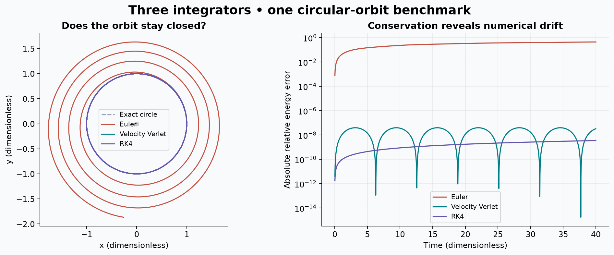

# Orbital Dynamics Simulation

**Chloe Lin · University College London · Python scientific computing**

**A plausible orbit is not enough: check what the numerical method conserves.**

Implemented Euler, velocity Verlet and RK4 for gravitational motion, then explored more complex three-body configurations in the original project (2025).



*New circular-orbit demonstration: identical initial conditions, timestep 0.02 and duration 40 in dimensionless units. Energy errors are shown on a logarithmic scale.*

**[Start the guided notebook](notebooks/main_analysis.ipynb)** · [Detailed logbooks](notebooks/logbooks) · [Presentation provenance](docs/PRESENTATION_NOTES.md)

## Selected results

### How much does the integration method matter?

The opening figure compares **Euler, velocity Verlet and RK4** using identical circular-orbit initial conditions, a timestep of **0.02** and a duration of **40** in dimensionless units. Euler develops substantial drift; Verlet shows bounded energy oscillations; RK4 has much smaller error over this short, smooth benchmark. Checking energy alongside the trajectory reveals errors that an orbit plot alone can hide.

### Does the result hold as the timestep changes?

The [guided notebook](notebooks/main_analysis.ipynb) compares numerical positions with the analytic circular orbit at progressively smaller timesteps and checks angular-momentum conservation. These diagnostics connect a visually plausible trajectory to measurable numerical accuracy.

### How do initial conditions affect three-body motion?

The [original logbooks](notebooks/logbooks) explore **27 triple-star parameter combinations**, varying separation, speed and inclination, alongside a simplified **500-year Alpha Centauri** investigation. These are exploratory comparisons of different starting configurations. They do not by themselves establish chaos or long-term stability; close encounters require additional timestep checks.

## My contribution

This was an individual coursework project. I implemented and analysed gravitational simulations in Python using NumPy, SciPy, Matplotlib and Pandas; compared Euler, Verlet and RK4; examined energy and angular momentum; and investigated two-body and three-body configurations.

The shorter guided notebook and opening figure are later portfolio additions. Their relationship to the original work and AI-assisted preparation is documented in [presentation notes](docs/PRESENTATION_NOTES.md).

## Limitations

- The circular-orbit benchmark is a smooth, idealised problem. Its method ranking should not be generalised to every timestep, integration duration or close encounter.
- The guided notebook checks its own benchmark; it does not revalidate all historical three-body outputs.
- Finite-duration trajectories do not prove long-term stability. The Alpha Centauri example uses a simplified model and is not a precision prediction of the real system.

## Acknowledgements

Completed as part of Computational Physics coursework at University College London. The [original logbooks](notebooks/logbooks) retain references to teaching material and scientific sources used in the project.

## Run the guided notebook

From the repository root, create and activate a Python virtual environment, then:

```sh
python -m pip install -r requirements-demo.txt
python -m jupyter lab notebooks/main_analysis.ipynb
```

The short notebook has saved outputs for browsing and runnable cells that regenerate the opening figure. It supports a working directory of either the repository root or `notebooks/`. The original project dependencies are listed separately in `requirements.txt`.

## Repository map

```text
README.md
notebooks/
  main_analysis.ipynb      # Start here
  logbooks/               # Original detailed work
figures/                  # Generated README figure
docs/                     # Review and provenance notes
requirements-demo.txt      # Guided notebook
requirements.txt           # Original project dependencies
```
